# TaskMaster
## Descripción de los documentos
## Direccion

| Campo         | Tipo   | Descripción               |
|---------------|--------|---------------------------|
| **calle**     | String | Nombre de la calle        |
| **num**       | String | Número de la vivienda     |
| **municipio** | String | Municipio de la dirección |
| **provincia** | String | Provincia de la dirección |
| **cp**        | String | Código postal             |

---
## Tarea

| Campo           | Tipo    | Descripción                           |
|-----------------|---------|---------------------------------------|
| **_id**         | String? | Identificador único en MongoDB        |
| **titulo**      | String  | Título de la tarea                    |
| **descripcion** | String  | Descripción detallada                 |
| **usuarioId**   | String  | Identificador del usuario que la creó |
| **completada**  | Boolean | Indica si ha sido completada          |

---

## Usuario

| Campo         | Tipo      | Descripción                                |
|---------------|-----------|--------------------------------------------|
| **_id**       | String?   | Identificador único en MongoDB             |
| **username**  | String    | Nombre de usuario (único)                  |
| **password**  | String    | Contraseña del usuario                     |
| **email**     | String    | Correo electrónico del usuario (único)     |
| **roles**     | String?   | Rol asignado al usuario (USER por defecto) |
| **direccion** | Direccion | Dirección del usuario                      |

---

# Endpoints y Descripción

### Autenticación (Accesible para todos)
- **POST /login** - Inicia sesión y devuelve un token de autenticación
- **POST /registro** - Registra un nuevo usuario

### Endpoints para Usuarios con Rol `USER`
- **GET /tareas** - Obtiene todas las tareas del usuario autenticado
- **POST /tareas** - Crea una nueva tarea para el usuario autenticado
- **PUT /tareas/{id}/completar** - Marca una tarea como completada
- **DELETE /tareas/{id}** - Elimina una tarea propia

### Endpoints para Usuarios con Rol `ADMIN`
- **GET /admin/tareas** - Obtiene todas las tareas de todos los usuarios
- **POST /admin/tareas** - Crea una nueva tarea para cualquier usuario
- **DELETE /admin/tareas/{id}** - Elimina cualquier tarea de cualquier usuario

---

## Lógica de Negocio
- Un usuario `USER` solo puede gestionar sus propias tareas
- Un usuario `ADMIN` puede gestionar tareas de todos los usuarios
- No se puede eliminar una tarea que no existe
- Una tarea solo puede marcarse como completada una vez

---

# Excepciones y Códigos de Estado

| Código HTTP                   | Descripción                         |
|-------------------------------|-------------------------------------|
| **200** OK                    | Operación exitosa                   |
| **201** Created               | Recurso creado con éxito            |
| **400** Bad Request           | Datos de entrada inválidos          |
| **401** Unauthorized          | Usuario no autenticado              |
| **403** Forbidden             | Usuario sin permisos para la acción |
| **404** Not Found             | Recurso no encontrado               |
| **500** Internal Server Error | Error inesperado del servidor       |

---

# Seguridad en la API REST
- Uso de **JWT** para autenticación y autorización
- Encriptación de contraseñas con **BCryptPasswordEncoder**
- Restricción de acceso a endpoints según el rol del usuario
- Validación de datos en las solicitudes

---

# Pruebas gestión usuarios
- Contraseña no coincide
  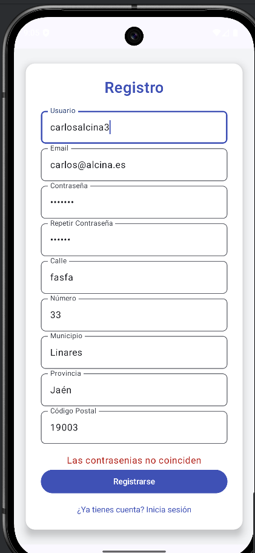
  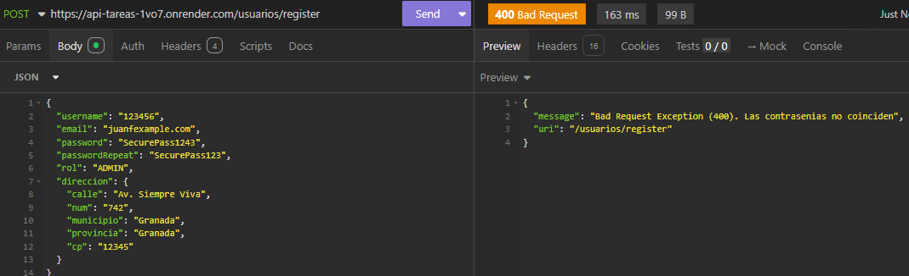
- Usuario ya registrado
  
  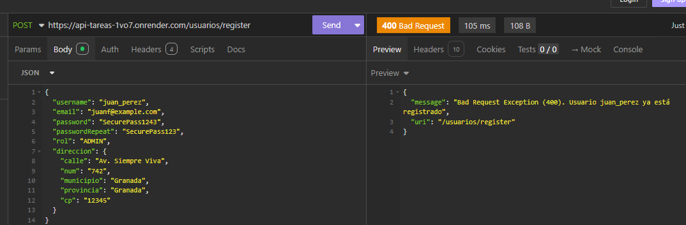
- Email inválido
  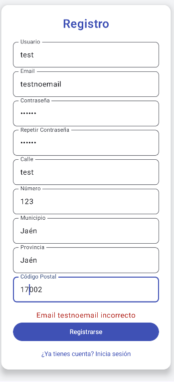
  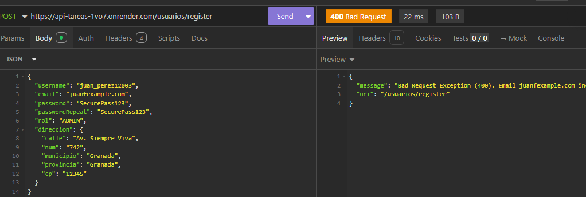
- Municipio inválido
  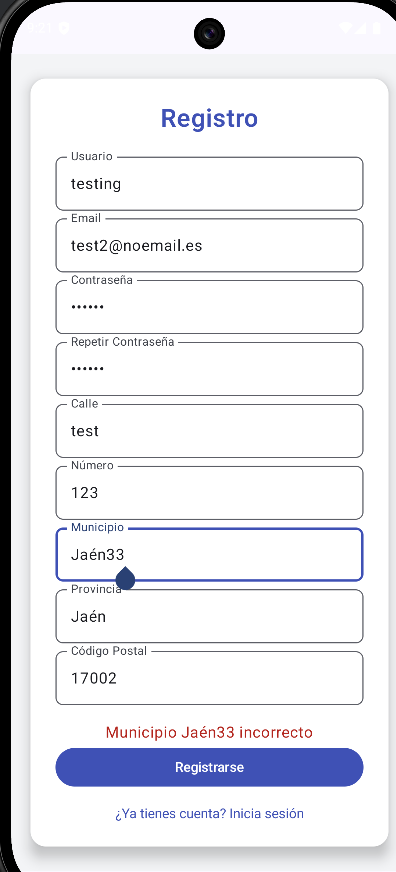
  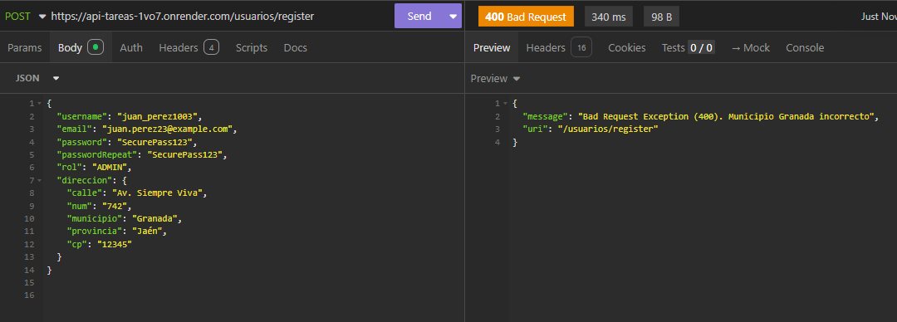
- Usuario registrado correctamente
  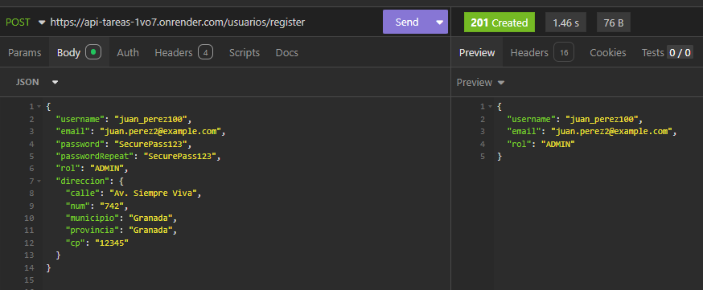
  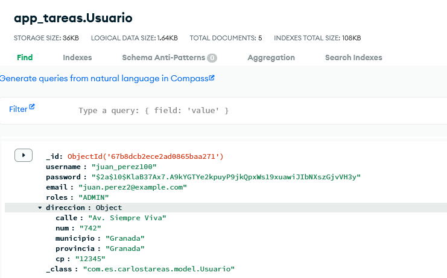
- Usuario logeado
    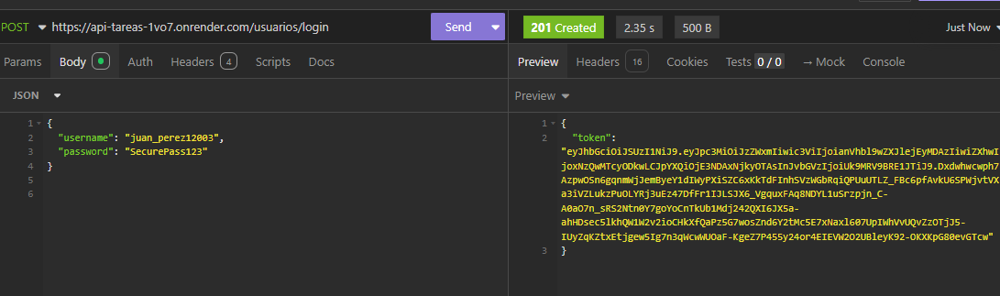
- Credenciales inválidas
    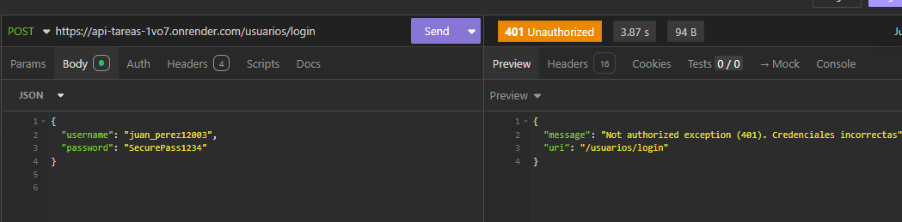