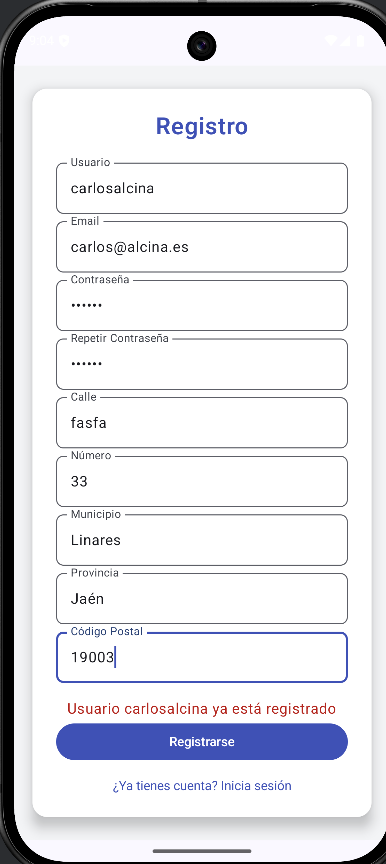

# TaskMaster
# Render: https://api-tareas-1vo7.onrender.com
## Descripción de los documentos
## Direccion

| Campo         | Tipo   | Descripción               |
|---------------|--------|---------------------------|
| **calle**     | String | Nombre de la calle        |
| **num**       | String | Número de la vivienda     |
| **municipio** | String | Municipio de la dirección |
| **provincia** | String | Provincia de la dirección |
| **cp**        | String | Código postal             |

---
## Tarea

| Campo           | Tipo    | Descripción                           |
|-----------------|---------|---------------------------------------|
| **_id**         | String? | Identificador único en MongoDB        |
| **titulo**      | String  | Título de la tarea                    |
| **descripcion** | String  | Descripción detallada                 |
| **usuarioId**   | String  | Identificador del usuario que la creó |
| **completada**  | Boolean | Indica si ha sido completada          |

---

## Usuario

| Campo         | Tipo      | Descripción                                |
|---------------|-----------|--------------------------------------------|
| **_id**       | String?   | Identificador único en MongoDB             |
| **username**  | String    | Nombre de usuario (único)                  |
| **password**  | String    | Contraseña del usuario                     |
| **email**     | String    | Correo electrónico del usuario (único)     |
| **roles**     | String?   | Rol asignado al usuario (USER por defecto) |
| **direccion** | Direccion | Dirección del usuario                      |

---

# Endpoints y Descripción

### Autenticación (Accesible para todos)
- **POST /login** - Inicia sesión y devuelve un token de autenticación
- **POST /registro** - Registra un nuevo usuario

### Endpoints para Usuarios con Rol `USER`
- **GET /tareas** - Obtiene todas las tareas del usuario autenticado
- **POST /tareas** - Crea una nueva tarea para el usuario autenticado
- **PUT /tareas/{id}/completar** - Marca una tarea como completada
- **DELETE /tareas/{id}** - Elimina una tarea propia

### Endpoints para Usuarios con Rol `ADMIN`
- **GET /admin/tareas** - Obtiene todas las tareas de todos los usuarios
- **POST /admin/tareas** - Crea una nueva tarea para cualquier usuario
- **DELETE /admin/tareas/{id}** - Elimina cualquier tarea de cualquier usuario

---

## Lógica de Negocio
- Un usuario `USER` solo puede gestionar sus propias tareas
- Un usuario `ADMIN` puede gestionar tareas de todos los usuarios
- No se puede eliminar una tarea que no existe
- Una tarea solo puede marcarse como completada una vez

---

# Excepciones y Códigos de Estado

| Código HTTP                   | Descripción                         |
|-------------------------------|-------------------------------------|
| **200** OK                    | Operación exitosa                   |
| **201** Created               | Recurso creado con éxito            |
| **400** Bad Request           | Datos de entrada inválidos          |
| **401** Unauthorized          | Usuario no autenticado              |
| **403** Forbidden             | Usuario sin permisos para la acción |
| **404** Not Found             | Recurso no encontrado               |
| **500** Internal Server Error | Error inesperado del servidor       |

---

# Seguridad en la API REST
- Uso de **JWT** para autenticación y autorización
- Encriptación de contraseñas con **BCryptPasswordEncoder**
- Restricción de acceso a endpoints según el rol del usuario
- Validación de datos en las solicitudes

---

# PRUEBAS GESTIÓN USUARIOS

## 1. Registro de usuario

### ✅ Usuario registrado correctamente
- **Descripción:** Un usuario se registra correctamente en el sistema.
- **Método:** `POST /usuarios/registro`
- **Código de estado esperado:** `201 Created`

  
  

### ❌ Errores posibles

#### 1.1 Contraseña no coincide
- **Código de estado esperado:** `400 Bad Request`

  
  

#### 1.2 Usuario ya registrado
- **Código de estado esperado:** `409 Conflict`

  
  

#### 1.3 Email inválido
- **Código de estado esperado:** `400 Bad Request`

  
  

#### 1.4 Municipio inválido
- **Código de estado esperado:** `400 Bad Request`

  
  

---

## 2. Inicio de sesión

### ✅ Usuario logueado correctamente
- **Descripción:** Un usuario inicia sesión con éxito.
- **Método:** `POST /usuarios/login`
- **Código de estado esperado:** `200 OK`

  

### ❌ Errores posibles

#### 2.1 Credenciales inválidas
- **Código de estado esperado:** `401 Unauthorized`

  

---

# PRUEBAS GESTIÓN TAREAS
## Pruebas para Usuario con Rol `USER`

### 1. Ver todas sus tareas
**Descripción:** Se realiza una solicitud para obtener todas las tareas del usuario autenticado.
- **Método:** `GET /tareas`
- **Respuesta esperada:** Lista de tareas pertenecientes al usuario.
- **Código de estado esperado:** `200 OK`

  
#### ❌ Errores posibles
Esto pasa en todas la ruta `/tareas` y solo lo voy a incluir aquí por no repetir lo mismo todo el rato
1. **Usuario no autenticado**
- **Código de estado esperado:** `401 Unathorized`

  

### 2. Marcar como hecha una tarea propia
**Descripción:** Un usuario intenta marcar como completada una de sus tareas.
- **Método:** `PUT /tareas/{id}/completar`
- **Respuesta esperada:** Confirmación de la actualización.
- **Código de estado esperado:** `200 OK`

  

#### ❌ Errores posibles
1. **Tarea no encontrada**
  - **Código de estado esperado:** `400 Bad Request`
  - **Mensaje esperado:** "Tarea no encontrada"

    

2. **Intento de marcar como hecha una tarea que no es suya**
  - **Código de estado esperado:** `401 Unauthorized`
  - **Mensaje esperado:** "No puedes marcar como hecha una tarea que no es tuya"

    

### 3. Eliminar una tarea propia
**Descripción:** Un usuario intenta eliminar una de sus tareas.
- **Método:** `DELETE /tareas/{id}`
- **Respuesta esperada:** Confirmación de eliminación.
- **Código de estado esperado:** `200 OK`

  

#### ❌ Errores posibles
1. **Tarea no encontrada**
  - **Código de estado esperado:** `400 Bad Request`
  - **Mensaje esperado:** "Tarea no encontrada"

    

2. **Intento de eliminar tarea de otro usuario**
  - **Código de estado esperado:** `403 Forbidden`
  - **Mensaje esperado:** "No puedes eliminar una tarea que no es tuya"

    

### 4. Darse de alta a sí mismo una tarea
**Descripción:** Un usuario crea una nueva tarea para sí mismo.
- **Método:** `POST /tareas`
- **Cuerpo:** `{ "titulo": "Nueva tarea", "descripcion": "Descripción de la tarea" }`
- **Respuesta esperada:** Confirmación de creación.
- **Código de estado esperado:** `201 Created`

  

#### ❌ Errores posibles
1. **Intento de crear una tarea para otro usuario**
  - **Código de estado esperado:** `401 Unauthorized`
  - **Mensaje esperado:** "No puedes asignar tareas a otro usuario"

    

---

## Pruebas para Usuario con Rol `ADMIN`

### 1. Ver todas las tareas
**Descripción:** Un administrador obtiene todas las tareas de todos los usuarios.
- **Método:** `GET /tareas`
- **Respuesta esperada:** Lista de todas las tareas en la base de datos.
- **Código de estado esperado:** `200 OK`

  

### 2. Eliminar cualquier tarea de cualquier usuario
**Descripción:** Un administrador elimina una tarea específica, en este caso un admin elimina la tarea de un NO ADMIN
- **Método:** `DELETE /tareas/{id}`
- **Respuesta esperada:** Confirmación de eliminación.
- **Código de estado esperado:** `200 OK`

  

#### ❌ Errores posibles
1. **Tarea no encontrada**
  - **Código de estado esperado:** `400 Bad Request`
  - **Mensaje esperado:** "Tarea no encontrada"

    

### 3. Dar de alta tareas a cualquier usuario
**Descripción:** Un administrador crea una tarea para un usuario específico, en este caso un usuario no admin
- **Método:** `POST /tareas`
- **Cuerpo:** `TareaInsertDTO`
- **Respuesta esperada:** Confirmación de creación.
- **Código de estado esperado:** `201 Created`

  

